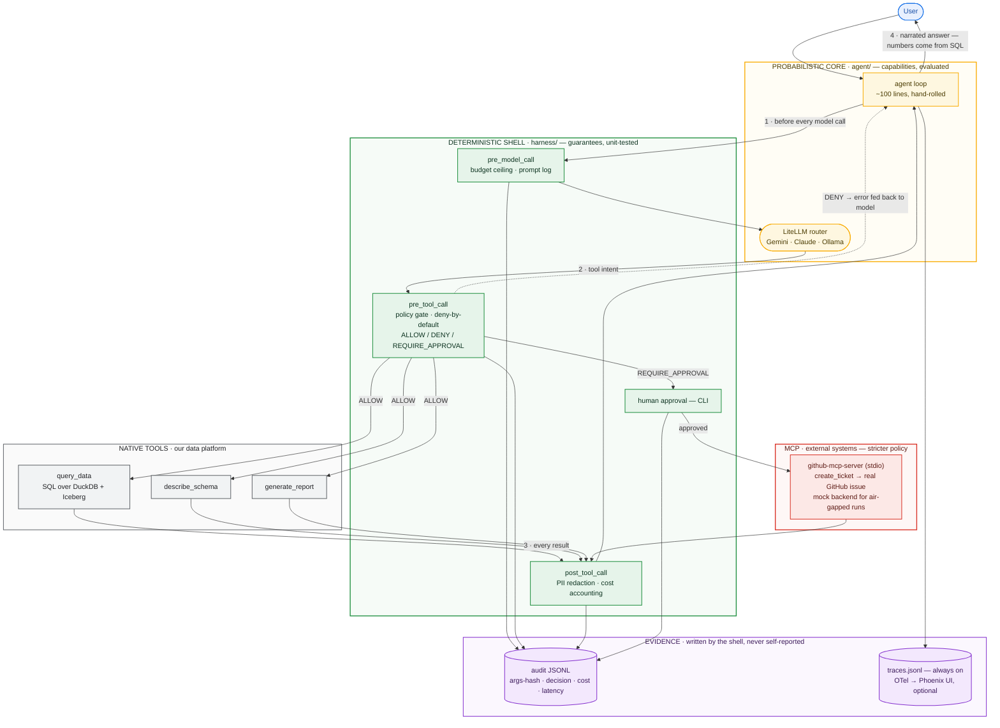
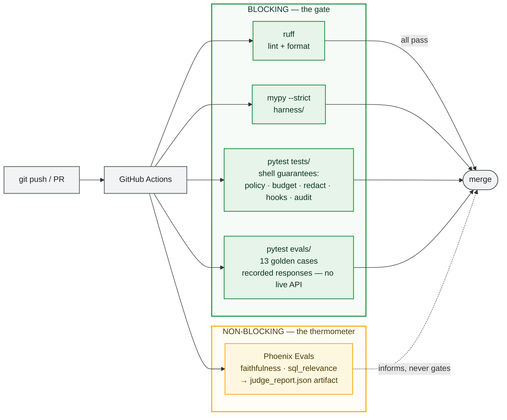
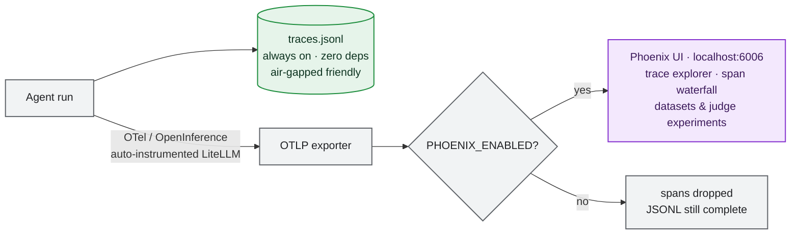

# agent-harness

*Safety harness for AI agents — deterministic policy, budget, and audit around a probabilistic core.
Runs anywhere: cloud or fully local, demoed over an Apache Iceberg lakehouse.*


---

## The problem

The model is probabilistic. The enterprise's obligations are not.

An audit requirement doesn't hold 95% of the time. A budget cap isn't a strong suggestion. PII rules don't have a temperature parameter. Prompts are influence, not control: you can't audit a prompt, and you can't unit-test a promise.

**Insight you can trust requires agents you can trust — and trust is architected, not prompted.**

---

## Quickstart

```bash
uv sync --all-extras           # install everything (uv.lock — no Docker needed)
cp .env.example .env           # add GEMINI_API_KEY (free tier at aistudio.google.com)
make demo                      # 4-panel live dashboard: query → report → approval → audit
```

---

## Architecture



**Green — deterministic shell · Amber — probabilistic core · Red — trust boundary (external systems) · Purple — evidence**

Reading the diagram:
1. Every model call passes the **budget hook** first — overruns are impossible by construction, not detected after.
2. Every tool intent passes the **policy gate** — deny-by-default, YAML-defined, evaluated in Python. The model cannot see, prompt-inject, or negotiate with it; a DENY is fed back as a tool error so the model can adapt, but the gate never moves.
3. Every result is **redacted before it reaches the model context** — the model can't leak what it never saw — then audited and costed.
4. The **audit trail is written by the shell**, not self-reported by the agent: forensics, not testimony. Same event shape for native, mock, and real external calls.
5. `harness/` never imports `agent/` — governance survives framework and model churn.

---

## Design principles

**AI, anywhere — cloud or fully private.** The same harness runs a cloud model (Gemini, Claude) or a local model (Ollama) with one config change: same tools, same policies, same audit. Nothing in the architecture assumes the model — or a single trace — ever leaves your infrastructure. `make demo-local` is the full experience air-gapped, not a degraded one. Models are deployment details.

**Data, anywhere — on the open lakehouse.** Facts are computed by SQL over **Apache Iceberg** — open table format, plain Parquet underneath, readable by any engine (DuckDB here; Spark, Trino, Impala tomorrow). The LLM decides *what* to ask and *how* to explain; it never invents a number. Iceberg is to the data lake what this harness is to the model: a deterministic metadata-and-control layer that turns a raw capability into something an enterprise can trust. Same pattern, two layers of the stack.

**Trusted by construction — governance travels with the agent.** Agents only get to run "anywhere" if the control plane goes with them. Policy, budget, redaction, and audit are lifecycle hooks in code — never prompts — and they apply uniformly: native tools, mock backends, and real third-party MCP servers cross the *same* gate, with external tools under *stricter* rules. A protocol standardizes the plug, not the safety: the question isn't whether your agent can connect, it's who governs the connection.

**Hybrid-honest observability.** Instrumented via OpenTelemetry/OpenInference — the backend is swappable for the same reason the model is. Local JSONL is the always-on, zero-dependency channel; Phoenix on `localhost:6006` is the optional lens. No telemetry leaves the machine unless you decide it should.

**Open and inspectable, end to end.** Python, DuckDB, Apache Iceberg, MCP, OpenTelemetry, Phoenix, pytest. Every layer that makes a guarantee is code you can read, and every guarantee is a unit test you can run. Every non-obvious decision is written down in [`docs/adr/`](docs/adr/).

**Boring dependencies, deliberate subtraction.** No agent framework (the loop is ~100 readable lines), no containers (nothing to orchestrate), no gateway, no vendor lock at any layer. Every dependency is a liability you must govern; every omission has an ADR.

---

## Demo Scripts

| Command | What it shows |
|---|---|
| `make demo` | Full flow: query → report → ticket |
| `make demo-block` | AST guard blocks `DELETE` in real time |
| `make demo-ticket` | `REQUIRE_APPROVAL` → CLI approve → audit chain |
| `make demo-budget` | Budget ceiling cuts execution at $0.001 |
| `make demo-local` | Same demo, fully offline with Ollama |
| `make demo-determinism` | Same risky prompt 3× → model varies, hook = identical |
| `make chat` | Interactive multi-turn REPL |

### Real GitHub issue (optional)

```bash
# Fine-grained PAT (Issues: Read & Write, single repo) + binary:
# brew install github-mcp-server
TICKETS_BACKEND=github make demo-ticket
```

Creates a real GitHub issue after CLI approval — same policy gate, same audit shape as mock. Least privilege at three layers: the token limits what the server *can* do, the policy limits what the agent *may* do, the approval limits what actually *happens*.

---

## Testing

```bash
make test       # unit tests — shell guarantees (blocking)
make evals      # 13 golden cases — recorded responses (blocking)
make ci         # lint + typecheck + test + evals
```

Two components, two verification regimes — mixing them up is a category error:
- the **shell is proven** — asserts on policy, budget, redaction, hooks; blocking in CI;
- the **core is measured** — golden cases against recorded responses (blocking, deterministic, zero API cost) plus LLM-as-judge experiments in Phoenix (informative, never gating).



CI never calls a live model. GitHub gates correctness; Phoenix measures quality — the deterministic/probabilistic split, applied to the quality infrastructure itself.

---

## Observability



The guaranteed channel (JSONL) is never optional; the pretty one (Phoenix) always is. Both stay on `localhost` — no telemetry leaves the machine unless you decide it should. The backend is swappable via OTel for the same reason the model is swappable via LiteLLM.

```bash
make phoenix                          # Phoenix UI at localhost:6006
PHOENIX_ENABLED=true make demo        # live OTel traces → Phoenix
make evals-judge                      # LLM-as-judge: faithfulness + sql_relevance
make upload-evals-phoenix             # upload golden cases as Phoenix Dataset + run experiment
```

---

## Stack

| Layer | Technology |
|---|---|
| Language | Python 3.12, uv |
| Contracts | Pydantic v2 |
| Model routing | LiteLLM (Gemini · Claude · Ollama) |
| Data | DuckDB + Apache Iceberg |
| Tool protocol | MCP (stdio) |
| Observability | Arize Phoenix (OTel/OTLP) + local JSONL |
| Testing | pytest + arize-phoenix-evals |
| Linting | ruff · mypy |

---

## Why No Containers

DuckDB is embedded (a Python library, not a server). Phoenix launches in-process.
The agent is a single process. Reproducibility comes from `uv.lock`, not an image layer.
