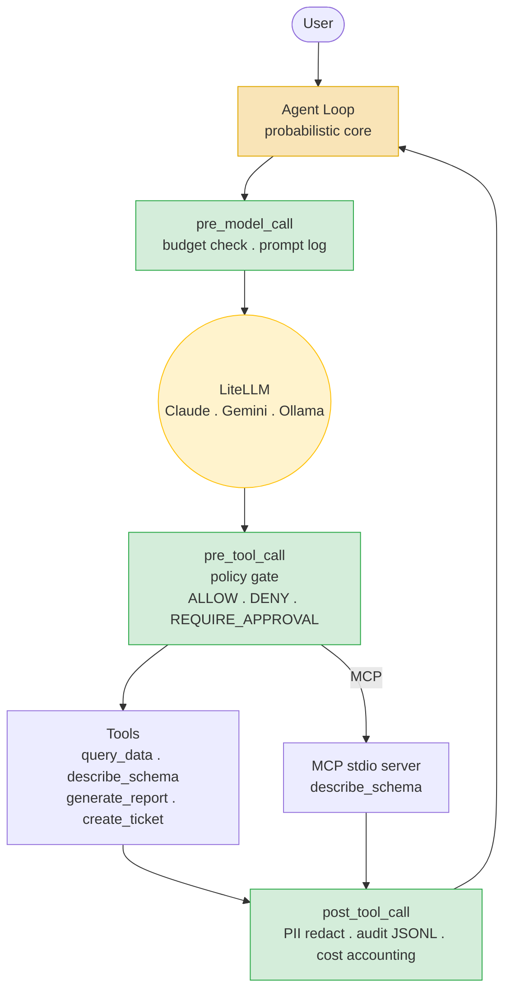

# agent-harness

*A deterministic shell for probabilistic agents -- policy, budgets, audit, and evals around a swappable core. Demoed on a Data Ops agent over Apache Iceberg.*

## Quickstart

```bash
uv sync --all-extras           # install everything
cp .env.example .env           # add your API keys
uv run pytest tests/ evals/    # all tests green before first model call
```

## Architecture



**Yellow = probabilistic core. Green = deterministic shell.**

## The Thesis

> The model is probabilistic. The enterprise's obligations are not.

The harness is a **deterministic shell of lifecycle hooks** around a **probabilistic core**.
Every policy decision, audit event, and cost check is computed in Python -- never in a prompt.
`harness/` never imports `agent/`: governance survives framework and model churn.

## Demo Scripts

```bash
make demo-determinism   # same risky prompt 3x -> model varies, hook = REQUIRE_APPROVAL always
make demo-policy        # create_ticket -> PENDING -> CLI approve -> audit chain printed
```

## Model Flip

```bash
DEFAULT_MODEL=ollama/qwen2.5:7b uv run python -c "
import asyncio, tools.echo
from agent.loop import run
print(asyncio.run(run('echo hello world')))
"
```

## Testing

```bash
make test       # unit tests (shell guarantees -- blocking)
make evals      # golden case evals (recorded responses -- blocking)
make ci         # lint + typecheck + test + evals
```

Mantra: *unit tests for guarantees, evals for capabilities.*

## Stack

Python 3.12 . uv . Pydantic v2 . LiteLLM . DuckDB + Apache Iceberg . MCP . Langfuse + local JSONL . pytest + DeepEval . ruff . mypy

See `docs/adr/` for all architectural decisions.
