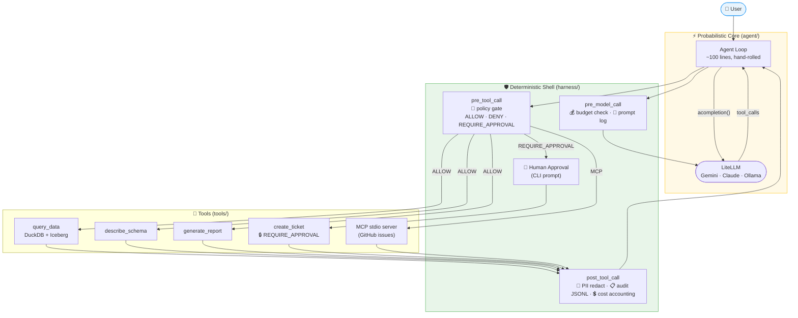

# agent-harness

*Safety harness for AI agents — deterministic policy, budget, and audit around a probabilistic core.
Runs anywhere: cloud or fully local, demoed over an Apache Iceberg lakehouse.*

---

## Quickstart

```bash
uv sync --all-extras           # install everything (uv.lock — no Docker needed)
cp .env.example .env           # add GEMINI_API_KEY (free tier at aistudio.google.com)
make demo                      # 4-panel live dashboard: query → report → approval → audit
```

---

## Architecture



**Yellow = probabilistic core &nbsp;·&nbsp; Green = deterministic shell**

> The model is probabilistic. The enterprise's obligations are not.
>
> Every policy decision, audit event, and cost check is computed in Python — never in a prompt.
> `harness/` never imports `agent/`: governance survives framework and model churn.

---

## Demo Scripts

| Command | What it shows |
|---|---|
| `make demo` | Full flow: query → report → ticket |
| `make demo-block` | AST guard blocks `DELETE` in real time |
| `make demo-ticket` | `REQUIRE_APPROVAL` → CLI approve → audit chain |
| `make demo-budget` | Budget ceiling cuts execution at $0.001 |
| `make demo-local` | Same demo, fully offline with Ollama |
| `make demo-determinism` | Same risky prompt 3× → model varies, hook = identical |
| `make chat` | Interactive multi-turn REPL |

### Real GitHub issue (optional)

```bash
# Fine-grained PAT (Issues: Read & Write, single repo) + binary:
# brew install github-mcp-server
TICKETS_BACKEND=github make demo-ticket
```

Creates a real GitHub issue after CLI approval — same policy gate, same audit shape as mock.

---

## Testing

```bash
make test       # unit tests — shell guarantees (blocking)
make evals      # 13 golden cases — recorded responses (blocking)
make ci         # lint + typecheck + test + evals
```

*Unit tests prove the shell with asserts. Evals measure the core with experiments.*

---

## Observability

```bash
make phoenix                          # Phoenix UI at localhost:6006
PHOENIX_ENABLED=true make demo        # live OTel traces → Phoenix
make evals-judge                      # LLM-as-judge: faithfulness + sql_relevance
make upload-evals-phoenix             # upload golden cases as Phoenix Dataset + run experiment
```

Instrumented via OpenTelemetry + OpenInference — backend-agnostic. Local JSONL (`traces.jsonl`) is the always-on zero-dependency path.

---

## Stack

| Layer | Technology |
|---|---|
| Language | Python 3.12, uv |
| Contracts | Pydantic v2 |
| Model routing | LiteLLM (Gemini · Claude · Ollama) |
| Data | DuckDB + Apache Iceberg |
| Tool protocol | MCP (stdio) |
| Observability | Arize Phoenix (OTel/OTLP) + local JSONL |
| Testing | pytest + arize-phoenix-evals |
| Linting | ruff · mypy |

See `docs/adr/` for every non-obvious architectural decision.

---

## Why No Containers

DuckDB is embedded (a Python library, not a server). Phoenix launches in-process.
The agent is a single process. Reproducibility comes from `uv.lock`, not an image layer.
